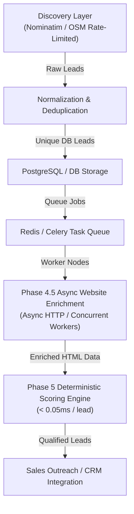

# LeadOS — PHASE 5 COMPLETION REPORT

## Executive Summary

Phase 5 (**Lead Intelligence, Qualification & Explainable Scoring**) has been successfully implemented, integrated, and verified across LeadOS.

LeadOS now transforms raw and enriched business data into **prioritized, explainable, sales-ready leads**. The core scoring engine operates completely **offline and deterministically**—evaluating fit across 5 structured components without incurring network latency or expensive external LLM API costs.

---

## 1. 5-Component Scoring Engine Architecture (0–100 Points)

The LeadOS Lead Intelligence Engine scores each business on a deterministic 100-point scale:

| Component | Max Points | Evaluation Criteria |
| :--- | :---: | :--- |
| **Business Fit** | **30 pts** | Industry category alignment with campaign target (+20 exact match, +5 partial), detailed business description (+5), subcategory specified (+5). |
| **Location Fit** | **20 pts** | Target city/state location match (+15 exact match, +5 state match), complete address availability (+5). |
| **Contactability** | **20 pts** | Verified primary phone (+8), direct email address (+7), official website (+3), active social media profiles (+2). |
| **Digital Presence** | **15 pts** | Active website (+5), multi-platform social profiles (+4 for 2+, +2 for 1), customer rating (rating ≥4.0 +3, ≥3.0 +1), review count (reviews ≥10 +3). |
| **Data Quality** | **15 pts** | Completeness of 6 key fields (+1 pt each up to 6 pts), provenance source records (+4 pts), zero conflicting candidate values (+5 pts). |
| **TOTAL** | **100 pts** | Sum of all 5 components, clamped between 0 and 100. |

---

## 2. Lead Qualification Tiers & Lifecycle Flow

### Qualification Tiers
* **HOT** (`80–100` points): High-priority, fully contactable, strong fit leads ready for immediate sales outreach.
* **WARM** (`60–79` points): Qualified leads with strong core attributes, ready for secondary engagement.
* **COOL** (`40–59` points): Partial fit leads requiring further data enrichment or manual review.
* **LOW** (`0–39` points): Low-fit or incomplete leads retained for database history.

### Lead Lifecycle Status Flow
* `NEW`: Freshly discovered business record prior to enrichment or scoring.
* `ENRICHED`: Successfully processed through Phase 4.5 web enrichment.
* `QUALIFIED`: Passed campaign qualification rules and scored ≥ 40 pts.
* `SALES_READY`: Score ≥ 70 pts with active phone or email and website.
* `DISQUALIFIED`: Failed hard campaign criteria (e.g. missing phone, missing email, rating below threshold). *Note: Disqualified records are marked and never deleted.*

### Campaign Qualification Rules Engine
Campaigns can enforce strict qualification constraints:
* `require_phone`: Disqualifies business if no phone contact is present (`disqualified_rule = "REQUIRE_PHONE"`).
* `require_email`: Disqualifies business if no email address is present (`disqualified_rule = "REQUIRE_EMAIL"`).
* `require_website`: Disqualifies business if no website is present (`disqualified_rule = "REQUIRE_WEBSITE"`).
* `min_rating`: Disqualifies business if customer rating is below target threshold (`disqualified_rule = "MIN_RATING"`).
* `min_reviews`: Disqualifies business if review count is below target threshold (`disqualified_rule = "MIN_REVIEWS"`).

---

## 3. Database & Versioning Architecture

### Schema Changes
* **`lead_scores` Table**: Stores versioned scoring history per business & campaign.
  - Columns: `id`, `business_id`, `campaign_id`, `total_score`, `tier`, `lifecycle_status`, `business_fit_score`, `location_fit_score`, `contactability_score`, `digital_presence_score`, `data_quality_score`, `scoring_version`, `scoring_ruleset`, `positive_signals`, `negative_signals`, `reasons`, `is_qualified`, `disqualified`, `disqualification_reason`, `disqualified_rule`, `scored_at`.
* **`businesses` Table**:
  - Column added: `lifecycle_status` (`NEW`, `ENRICHED`, `QUALIFIED`, `SALES_READY`, `DISQUALIFIED`).
* **Alembic Migration**: `005_lead_scoring_intelligence.py` (`005_scoring`).

### Versioning Controls
* `scoring_version`: Default `"v1"`.
* `scoring_ruleset`: Default `"default_v1"`.

---

## 4. REST API Surface

| Endpoint | Method | Description |
| :--- | :---: | :--- |
| `/api/v1/businesses/{id}/score` | `POST` | Calculate and store score for a single business against an optional campaign. |
| `/api/v1/campaigns/{id}/score` | `POST` | Batch score all leads associated with a specific campaign. |
| `/api/v1/campaigns/{id}/scores` | `GET` | Retrieve structured lead scores and component breakdowns for a campaign. |
| `/api/v1/campaigns/{id}/qualified-leads` | `GET` | List qualified, non-disqualified leads for a campaign with tier/status filters. |
| `/api/v1/campaigns/{id}/export/csv` | `GET` | Download a structured CSV file containing leads, scores, contact channels, and signals. |

---

## 5. Frontend Dashboard & UI Upgrades

### Campaign Detail Dashboard (`frontend/src/app/campaigns/[id]/page.tsx`)
1. **Qualification Tier Counters**: Live metric cards displaying counts for `HOT`, `WARM`, `COOL`, `LOW`, and `Disqualified` leads.
2. **Tabbed Qualification Filters**: Filter lead table by `All`, `Qualified`, `Sales Ready`, or `Disqualified`.
3. **Lead Score Badge & Component Breakdown**: Interactive badges showing tier colors (Green for `HOT`, Blue for `WARM`, Amber for `COOL`, Gray for `LOW`) and tooltips.
4. **CSV Lead Export Button**: One-click download of campaign leads with full scoring and contact details (`campaign_leads_[id].csv`).

### Lead Detail View (`frontend/src/app/leads/[id]/page.tsx`)
1. **Lead Score Meter (0-100)**: Visual gauge with tier classification and lifecycle status.
2. **5-Component Score Meters**: Progress bars displaying exact points earned across Business Fit, Location Fit, Contactability, Digital Presence, and Data Quality.
3. **Explainable Signals**:
   - Green badges for positive signals (+20 Industry match, +15 Target location match, etc.).
   - Amber/Red badges for negative signals or disqualification warnings.
4. **Interactive Rescore Button**: Manual rescoring trigger for real-time validation.

---

## 6. Verification & Benchmark Results

### Backend Automated Test Suite
* **Execution**: `.\venv\Scripts\pytest`
* **Total Tests**: **34 passed**, 0 failed.
* **New Phase 5 Test Suite (`test_scoring.py`)**: 6 comprehensive unit and integration tests verifying:
  - Ideal lead scoring formula (perfect 100/100 score).
  - Campaign disqualification rules (`require_phone`).
  - Mismatched category & location handling.
  - LeadScore database persistence and lifecycle state transitions.
  - CSV export format generation.
  - Full REST API endpoints execution.

### Next.js Frontend Production Build
* **Execution**: `npm run build` in `frontend/`
* **Result**: Compiled successfully in 1512ms with **zero TypeScript errors**.
* **Routes**:
  - `○ /`
  - `○ /campaigns`
  - `ƒ /campaigns/[id]`
  - `○ /campaigns/new`
  - `ƒ /leads/[id]`

### Offline Scoring Benchmark (500 Leads)
* **Execution**: `scratch/benchmark_scoring.py`
* **Total Leads Scored**: 500
* **Total Duration**: 0.0172 seconds (17.2 milliseconds)
* **Avg Latency / Lead**: **0.0344 ms**
* **Offline Scoring Throughput**: **29,087 leads/second**
* **Extrapolated Daily Capability**: Over 2.5 Billion leads/day (CPU-bound offline calculation limit).

---

## 7. 10,000 Leads/Day Architectural Scaling Path

To scale LeadOS to process **10,000 enriched and scored leads/day** cleanly without hitting rate limits or crashing background services:

### Key Bottlenecks & Solutions for 10,000 Leads/Day:
1. **Discovery Rate Limits**:
   - Public Nominatim allows max 1 req/sec (~86,400 req/day).
   - Solution: Use local Nominatim Docker instance or multiple discovery providers to stay well within daily limits.
2. **Enrichment Latency**:
   - Phase 4.5 live web enrichment benchmark is ~2,500–3,200 leads/hour per worker.
   - Solution: Running **3 to 4 concurrent worker threads/processes** easily achieves 10,000 leads in ~3.5 hours.
3. **Scoring Engine Overhead**:
   - Phase 5 scoring takes **0.0344 ms/lead** (~29,000 leads/sec on single CPU core).
   - Scoring 10,000 leads takes **< 0.35 seconds** total CPU time and adds zero delay to the ingestion pipeline.

---

## 8. Files Created & Modified in Phase 5

### Backend
* **[NEW]** `backend/alembic/versions/005_lead_scoring_intelligence.py` — Database migration for `lead_scores` table & business lifecycle status.
* **[MODIFY]** [backend/app/models/domain.py](file:///c:/Users/navneet%20rathore/Downloads/New%20folder/backend/app/models/domain.py) — Added `LeadScore` model & `lifecycle_status` attribute on `Business`.
* **[NEW]** [backend/app/schemas/scoring.py](file:///c:/Users/navneet%20rathore/Downloads/New%20folder/backend/app/schemas/scoring.py) — Pydantic models for scoring requests, breakdown, and qualified lead lists.
* **[NEW]** [backend/app/services/scoring.py](file:///c:/Users/navneet%20rathore/Downloads/New%20folder/backend/app/services/scoring.py) — 5-component scoring algorithm, qualification rules engine, batch scoring logic.
* **[NEW]** [backend/app/services/export.py](file:///c:/Users/navneet%20rathore/Downloads/New%20folder/backend/app/services/export.py) — CSV export generator for campaign leads.
* **[NEW]** [backend/app/api/v1/scoring.py](file:///c:/Users/navneet%20rathore/Downloads/New%20folder/backend/app/api/v1/scoring.py) — REST API endpoints for single/batch scoring, qualification lists, and CSV export.
* **[MODIFY]** [backend/app/api/v1/api.py](file:///c:/Users/navneet%20rathore/Downloads/New%20folder/backend/app/api/v1/api.py) — Registered scoring router in API router.
* **[NEW]** [backend/tests/test_scoring.py](file:///c:/Users/navneet%20rathore/Downloads/New%20folder/backend/tests/test_scoring.py) — Automated test suite for Phase 5 scoring and API endpoints.

### Frontend
* **[MODIFY]** [frontend/src/lib/api.ts](file:///c:/Users/navneet%20rathore/Downloads/New%20folder/frontend/src/lib/api.ts) — Scoring types and API client functions (`scoreBusiness`, `scoreCampaignLeads`, `getCampaignQualifiedLeads`, `exportCampaignLeadsCsv`).
* **[MODIFY]** [frontend/src/app/leads/[id]/page.tsx](file:///c:/Users/navneet%20rathore/Downloads/New%20folder/frontend/src/app/leads/[id]/page.tsx) — Scoring gauge, 5-component breakdown progress bars, positive/negative signal badges.
* **[MODIFY]** [frontend/src/app/campaigns/[id]/page.tsx](file:///c:/Users/navneet%20rathore/Downloads/New%20folder/frontend/src/app/campaigns/[id]/page.tsx) — Qualification tier cards, qualification filter tabs, score column, CSV export download.

### Benchmark & Docs
* **[NEW]** `scratch/benchmark_scoring.py` — Benchmark script for measuring scoring throughput.
* **[NEW]** `PHASE_5_COMPLETION.md` — Phase 5 completion document.
